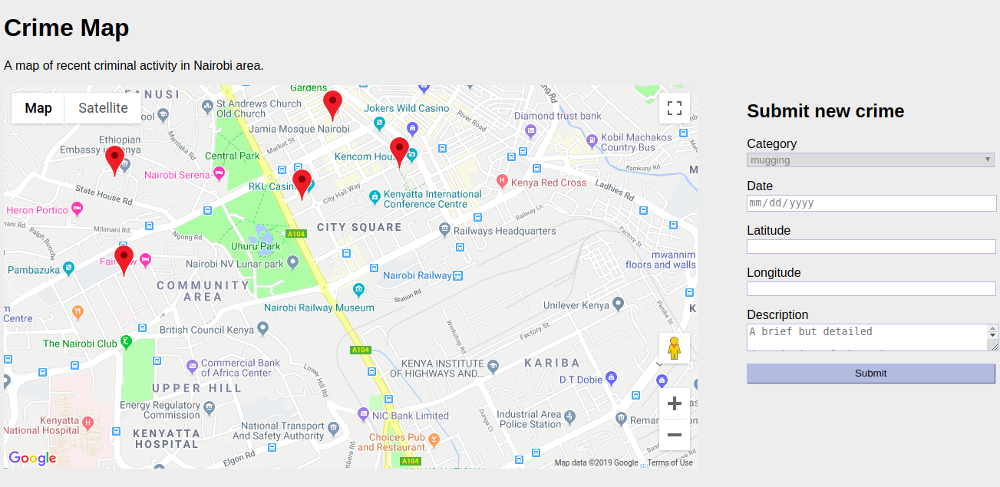

CRIME MAP
===============

This application provides an interactive map that allows users to tag
locations with details of witnessed or experienced criminal activities.

This will allow users to easily identify areas with high crime rates 
and assist investigators in detecting patterns and trends in crime.

### Below is a preview of the site

